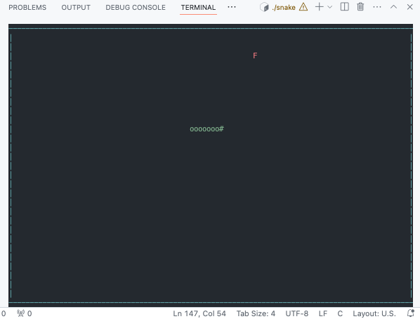

# Snake Game 🐍



Classic snake game for the terminal, made with C and ncurses. Guide the snake to eat the food and grow, while avoiding collisions with its own body!

[Download latest Linux binary](https://github.com/petemihaylov/SnakeGame/actions/runs/11539518469)

## Features
- **Boundary Wrapping**: The snake wraps around the screen edges, reappearing on the opposite side.
- **Self-Collision Detection**: Game ends only when the snake collides with itself.
- **Timed Food Regeneration**: Food regenerates every 7 seconds if uneaten.

## Dependencies
Install the ncurses library if you don't already have it:
```bash
sudo apt-get install -y libncurses5-dev
```

## Usage
1. Compile the game:
   ```bash
   make
   ```

2. Run the game:
   ```bash
   ./snake
   ```
   
## Controls
| Key             | Action               |
| --------------- | -------------------- |
| **←**           | Move Left            |
| **↑**           | Move Up              |
| **→**           | Move Right           |
| **↓**           | Move Down            |
| **q**           | Quit the Game        |


Enjoy the game in your terminal!

---

*Note*: This game was built as a fun exercise in C programming and terminal-based graphics with `ncurses`. Feel free to explore and modify the code for added functionality!

